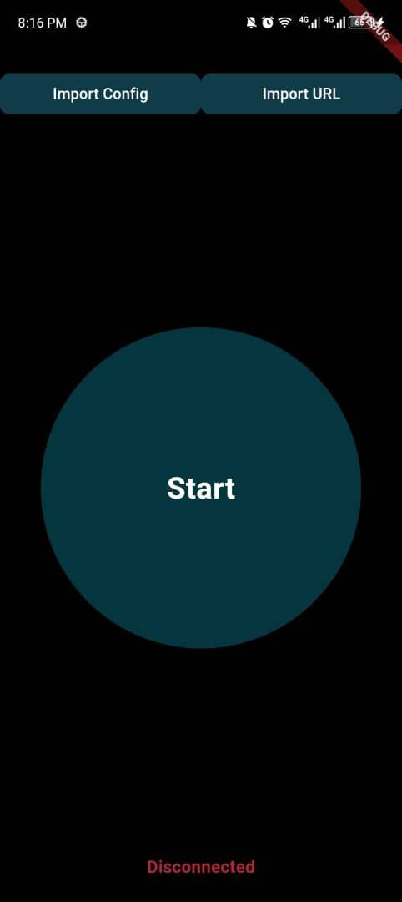

# Rae VPN

Rae VPN is a Flutter-based mobile application that provides a user-friendly interface for managing V2Ray VPN connections. This app allows users to import V2Ray configurations, connect to VPN servers, and monitor their connection status.

## Features

- Import V2Ray configurations from files or URLs
- Connect and disconnect from VPN servers
- Display connection status and duration
- Dark mode user interface

## App Screenshots





## Technologies Used

- Flutter: Cross-platform UI framework
- Dart: Programming language
- flutter_v2ray: Plugin for V2Ray integration
- file_picker: File selection functionality

## Project Structure

```
rae_vpn/
├── android/
├── ios/
├── lib/
│   ├── screens/
│   │   └── home_screen.dart
│   ├── services/
│   │   └── v2ray_service.dart
│   ├── widgets/
│   │   ├── import_button.dart
│   │   └── vpn_button.dart
│   ├── main.dart
│   └── home_screen.dart
├── pubspec.yaml
└── README.md
```

## Main Components and Their Roles

1. **main.dart**: Entry point of the application. It initializes the V2Ray service and sets up the main app widget.

2. **home_screen.dart**: Contains the `HomeScreen` widget, which is the main UI of the application. It includes the VPN connection button, import options, and displays the connection status.

3. **v2ray_service.dart**: Manages the V2Ray service, including starting and stopping the VPN connection, saving and retrieving configurations, and tracking the connection duration.

4. **vpn_button.dart**: A custom widget for the main VPN connection button, which changes appearance based on the connection state.

5. **import_button.dart**: A custom widget for importing V2Ray configurations, either from a file or a URL.

## How to Build and Run

1. Ensure you have Flutter installed on your system. If not, follow the [official Flutter installation guide](https://flutter.dev/docs/get-started/install).

2. Clone the repository:
   ```
   git clone https://github.com/Ashrafty/RAE-VPN.git
   cd rae_vpn
   ```

3. Install dependencies:
   ```
   flutter pub get
   ```

4. Run the app on a connected device or emulator:
   ```
   flutter run
   ```

## Usage

1. Launch the Rae VPN app on your device.
2. Import a V2Ray configuration using either the "Import Config" or "Import URL" button.
3. Once a configuration is imported, tap the large VPN button in the center of the screen to connect.
4. The button will change appearance and the connection status will be displayed when connected.
5. Tap the button again to disconnect from the VPN.

## Note

This app requires proper V2Ray configurations to function correctly. Ensure you have valid V2Ray server details before attempting to connect.

get a server config from https://howdy.id/xray-vmess-vless-trojan/ import the link and you are ready to use or if you have your own custom server you can import your files and use

## License

<!-- [Add your license information here] -->

## Contributing

<!-- [Add contribution guidelines here] -->

## Support

<!-- [Add support information or contact details here] -->
